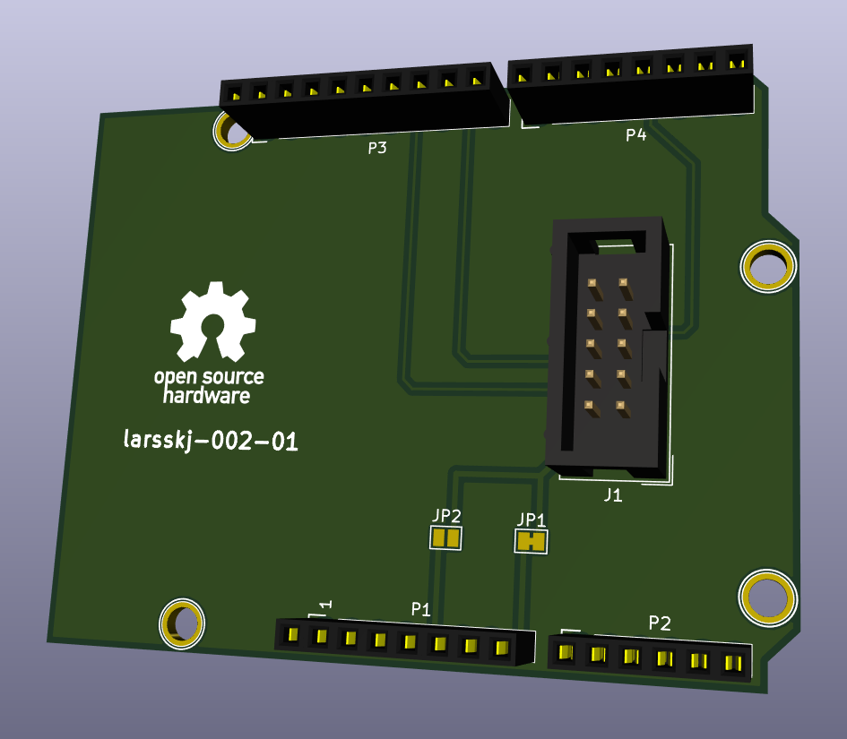

An Arduino shield for connecting TLC 5940 boards
================================================

### larsskj-002

This project is an Arduino shield created in KiCAD to connect one or more TLC 5940 LED controllers using ordinary IDC connectors and flat cable.

The board is shared at [OSH Park](https://oshpark.com/shared_projects/Qwm4SQ2z), where you can order copies.

